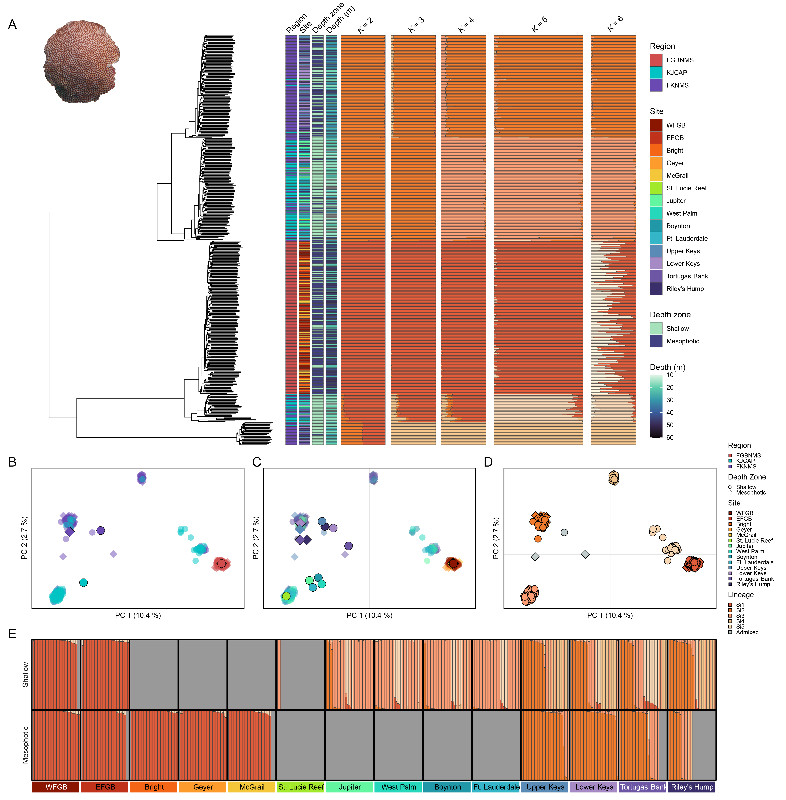

# Regional_PopGen
 Population genetics of *Stepahanocoenia intersepta* and *Xestospongia muta* across MPAs in the NWGOM and Florida

### Ryan Eckert -- <ryan.j.eckert@gmail.com>
### [ryanjeckert.weebly.com](https://ryanjeckert.weebly.com)
### version: 05 May, 2025

------------------------------------------------------------------------
 
 
 

This repository contains scripts and data associated with the publication:
**[Eckert RJ, Sturm AB, Pantoni GS, Carreiro AM, Herrera S, Voss JD (in prep). Population genetic structuring varies across depth and region in corals and sponges in marine protected areas of the Gulf of Mexico and Florida.](https://)**

------------------------------------------------------------------------

With unprecedented anthropogenically influenced declines on coral reefs across the globe, now more than ever, effective management, conservation, and restoration practices are essential for the persistence of critical marine species and habitats. Population genetic analyses have become more commonplace, presenting unique opportunities to quantify fine-resolution genetic diversity, population structuring, and connectivity not previously possible. In this study we used population genetic approaches to estimate the genetic diversity and genetic connectivity of coral and sponge populations across the northwestern Gulf of Mexico and Southeast Florida. Using 2bRAD-seq, we genotyped *Stephanocoenia intersepta* corals and the giant barrel sponge *Xestospongia muta* across shallow and mesophotic depths throughout Flower Garden Banks National Marine Sanctuary (FGBNMS), Florida Keys National Marine Sanctuary, and Kristin Jacobs Coral Aquatic Preserve. Both species were composed of multiple cryptic lineages, with lineages in FGBNMS distinct from those found within Florida MPAs. In *S. intersepta*  five lineages were identified, with limited admixture and strong population structure in Florida, especially across depth, but was panmictic in FGBNMS. In contrast, *X. muta* comprised seven lineages with greater rates of admixture. Genetic diversity was lower within FGBNMS for both taxa, highlighting the influence of geographic isolation and larval dispersal on genetic resilience. These findings stress the importance of species- and region-specific assessments of population connectivity for conservation planning and suggest that reduced connectivity may constrain FGBNMS populations and preclude them as a viable genetic reservoir for populations on more degraded reefs in Florida. This study provides a critical baseline to inform adaptive management and for integrating genetic information into restoration across these regions.

------------------------------------------------------------------------

2bRAD Lab protocols adapted from [Misha Matz](https://docs.google.com/document/d/1am7L_Pa5JQ4sSx0eT5j4vdNPy5FUAtMZRsJZ0Ar5g9U/edit?usp=sharing)

------------------------------------------------------------------------

#### Protocols and walkthroughs accompanying this manuscript:

1.  [Protocol for DNA extraction](https://ryaneckert.github.io/labProtocols/dnaExtraction/)
2.  [Protocol for 2bRAD wet lab (based on https://github.com/z0on/2bRAD_denovo)](https://ryaneckert.github.io/labProtocols/2bRAD/)
3. [2bRAD analyses (adapted from https://github.com/z0on/2bRAD_denovo)](https://ryaneckert.github.io/Regional_PopGen/code/)
4.  [Statistical analysis of SNP data](https://ryaneckert.github.io/Regional_PopGen/data/)
5.  [Sequncing data (NCBI PRJNA1186221](https://www.ncbi.nlm.nih.gov/biosample?Db=biosample&DbFrom=bioproject&Cmd=Link&LinkName=bioproject_biosample&LinkReadableName=BioSample&ordinalpos=1&IdsFromResult=1186221) [, PRJNA1222908](https://www.ncbi.nlm.nih.gov/biosample?Db=biosample&DbFrom=bioproject&Cmd=Link&LinkName=bioproject_biosample&LinkReadableName=BioSample&ordinalpos=1&IdsFromResult=1222908) [, PRJNA884416](https://www.ncbi.nlm.nih.gov/biosample?Db=biosample&DbFrom=bioproject&Cmd=Link&LinkName=bioproject_biosample&LinkReadableName=BioSample&ordinalpos=1&IdsFromResult=884416) [, PRJNA1037527](https://www.ncbi.nlm.nih.gov/biosample?Db=biosample&DbFrom=bioproject&Cmd=Link&LinkName=bioproject_biosample&LinkReadableName=BioSample&ordinalpos=1&IdsFromResult=1037527))

------------------------------------------------------------------------
